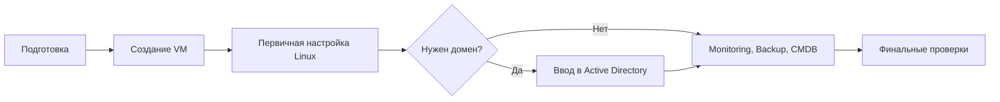

# Linux VM Deployment Runbook

Репозиторий описывает общий процесс подготовки и развертывания обычной виртуальной Linux-машины в корпоративной инфраструктуре.

- понятную последовательность действий;
- разделение ответственности между командами;
- контрольные точки перед переходом к следующему этапу;
- основу для внутреннего runbook и будущей автоматизации;
- критерии готовности сервера к передаче владельцу.

Это не готовая production-инструкция. Перед применением ее необходимо адаптировать под конкретные версии ОС, гипервизор, сеть, AD, monitoring, backup и требования безопасности.

## General sequence



### 1. Preparation

Определяются назначение сервера, владелец, ресурсы, IP и DNS, сетевые сегменты, доступ, необходимость домена, backup, monitoring и окно обслуживания.

Документ: [Подготовка к развертыванию](docs/01-preparation.md)

### 2. Creating a Linux VM

Создается виртуальная машина, подключаются диски и сети, разворачивается ОС, настраиваются hostname, сеть, DNS, время, обновления и базовая защита.

Документ: [Создание Linux VM](docs/02-vm-creation.md)

### 3. Entering the domain

Этап выполняется только при необходимости доменной аутентификации. Проверяются DNS и время, сервер присоединяется к AD, а доступ ограничивается согласованными группами.

Документ: [Ввод Linux VM в домен](docs/03-domain-join.md)

## Repository structure

```text
.
├── README.md
├── docs
│   ├── 01-preparation.md
│   ├── 02-vm-creation.md
│   └── 03-domain-join.md
├── examples
│   ├── cloud-init.yaml
│   ├── netplan-single-nic.yaml
│   ├── netplan-dual-nic.yaml
│   └── rhel-network-nmcli.sh
└── SECURITY.md
```

## Test values

В примерах используются только безопасные значения для документации:

- домен: `corp.example.com`;
- VM: `linux-vm-01.corp.example.com`;
- основная сеть: `192.0.2.0/24`;
- дополнительная сеть: `198.51.100.0/24`;
- тестовая маршрутная сеть: `203.0.113.0/24`.
